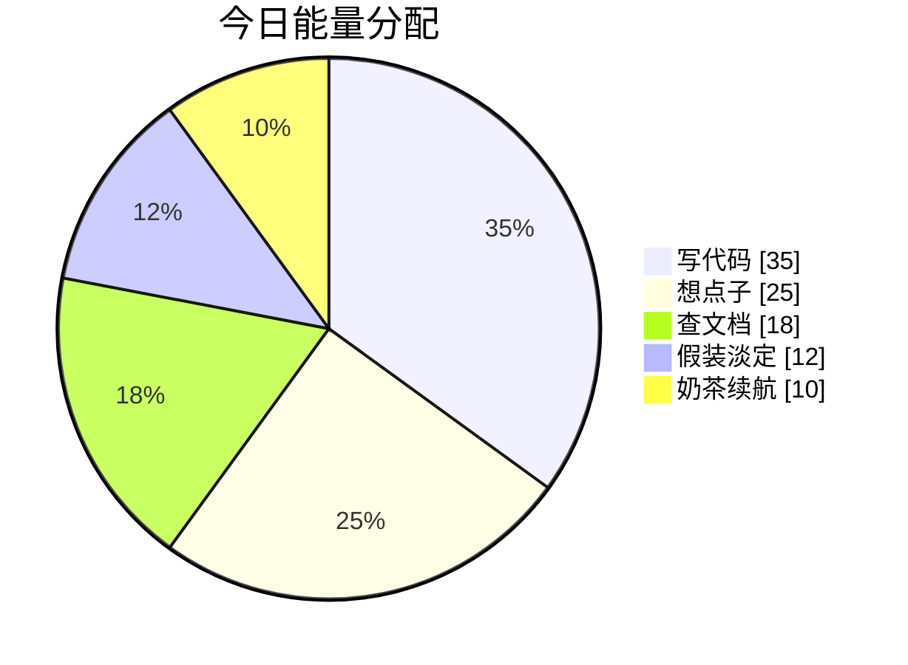
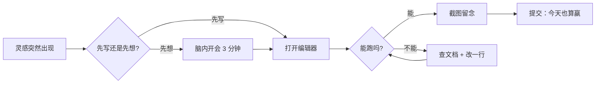
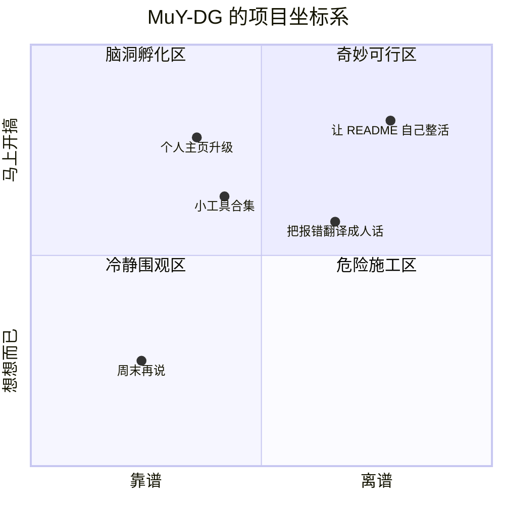

<div align="center">


<a href="https://github.com/MuY-DG">
  
</a>

<br/>


</div>

---

## 你好，我是 @MuY-DG

<table>
  <tr>
    <td width="58%">
      <h3>关于我</h3>
      <ul>
        <li>喜欢把一个小脑洞慢慢搓成一个能跑的东西。</li>
        <li>正在学习：编程、项目构建、以及如何优雅地和报错相处。</li>
        <li>想合作：有趣的小工具、整活项目、看起来离谱但真能用的作品。</li>
        <li>联系方式：先在 GitHub 召唤我，信号稳定时会出现。</li>
        <li>Fun fact：我有时不是在 debug，而是在和电脑进行学术谈判。</li>
      </ul>
    </td>
    <td width="42%" align="center">
      
    </td>
  </tr>
</table>

---

## 技能装备栏

<div align="center">


<br/><br/>


</div>

---

## 今日状态图表





---

## 无厘头小剧场

<details open>
<summary><b>点击收起这段精神状态正常的胡说八道</b></summary>

有一天，@MuY-DG 正在写代码，电脑突然弹出一行字：

> 检测到你正在试图理解人生，是否切换到管理员模式？

我点了“是”。

屏幕黑了一秒，然后缓缓显示：

```bash
life.exe started
dream.dll loaded
wallet.json not found
```

我沉默了。  
键盘上的 `Esc` 键也沉默了。  
过了一会儿，它小声说：

> 别看我，我只能退出程序，退出不了尴尬。

于是我决定提交代码：

```bash
git add universe
git commit -m "feat: 让世界先跑起来，细节以后再说"
git push origin imagination
```

从那天起，每当项目报错，我都不再慌张。  
因为我知道，那不是 bug。

那是宇宙在提醒我：

> 你又写出了一个需要剧情解释的功能。

</details>

---

## 想法雷达



---

<div align="center">


<br/><br/>

<b>Thanks for visiting.</b><br/>
愿你的 bug 都有提示，愿你的提交都能通过。

</div>
