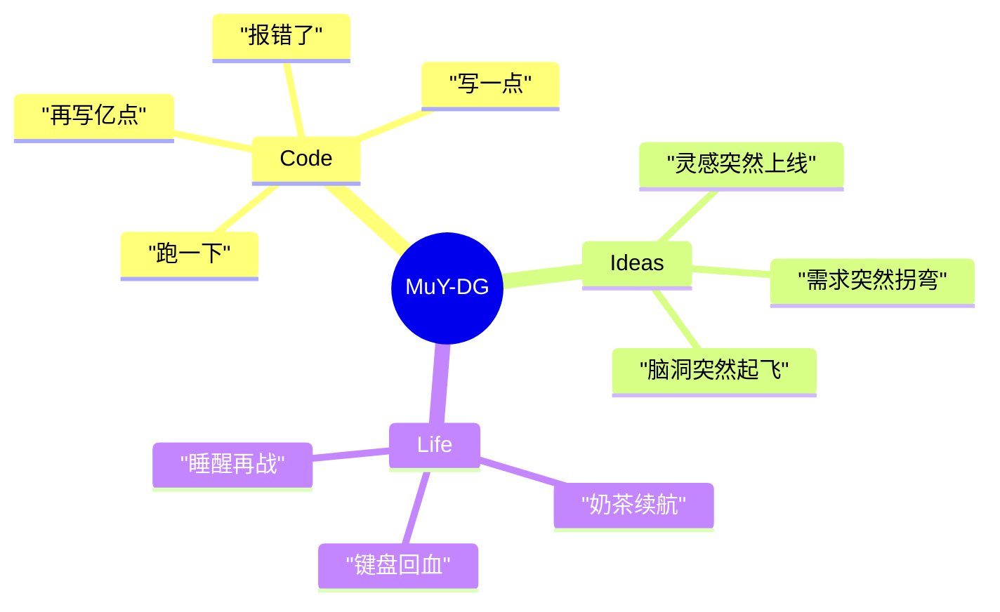
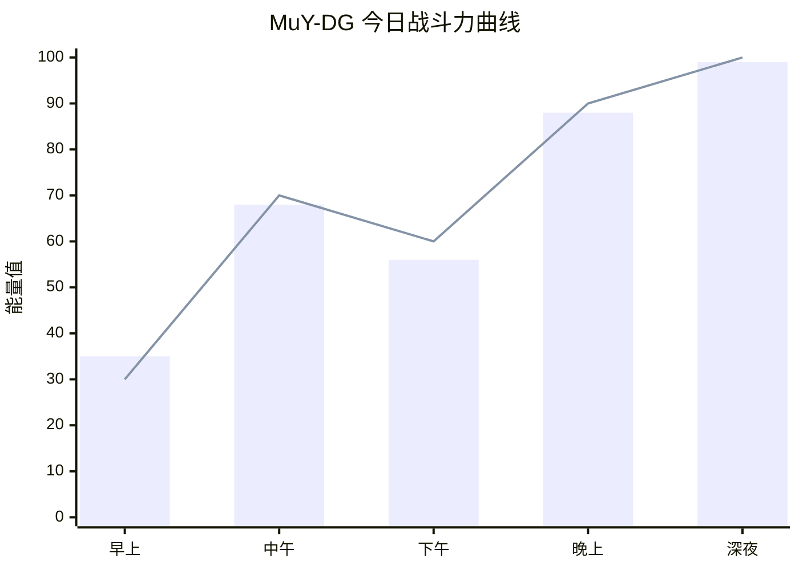
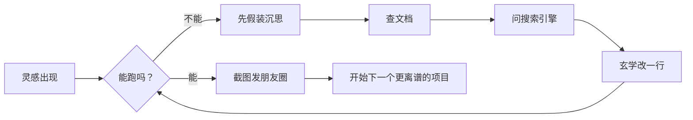
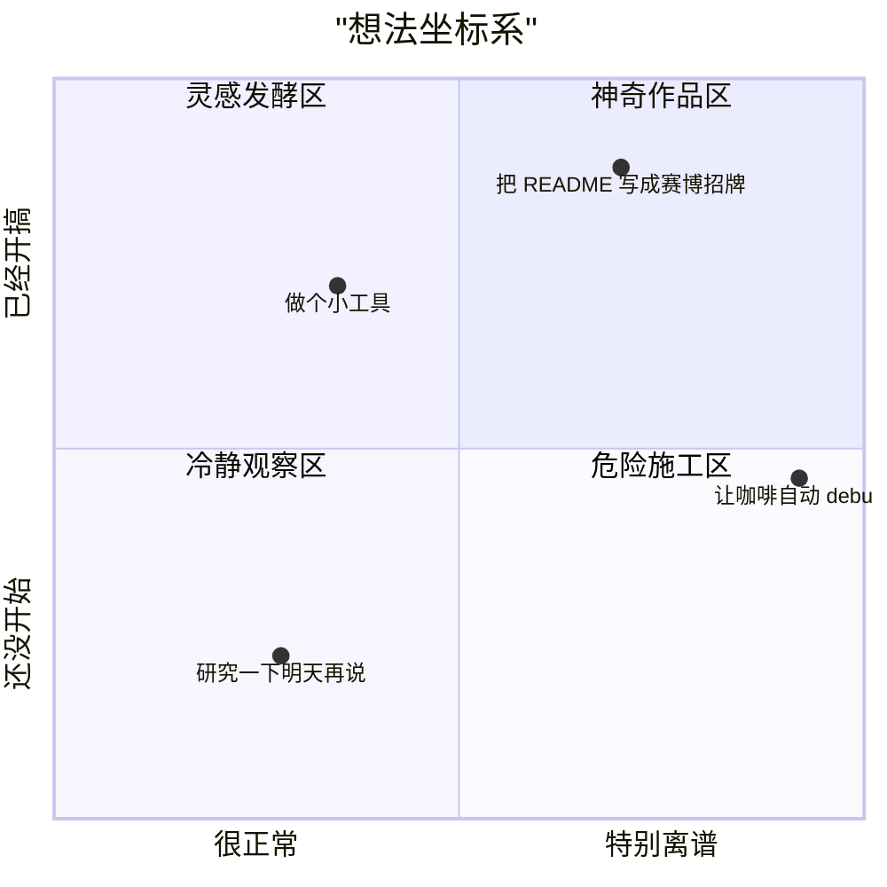

[<div align="center">


[;%E6%AD%A3%E5%9C%A8%E6%8A%8A%E7%81%B5%E6%84%9F%E7%85%AE%E6%88%90%E4%BB%A3%E7%A0%81...;%E4%BB%8A%E5%A4%A9%E7%9A%84%E8%AE%A1%E5%88%92%EF%BC%9A%E5%85%88%E5%86%99%E5%AE%8C%EF%BC%8C%E5%86%8D%E8%A3%85%E9%85%B7)](https://git.io/typing-svg)


---

##  关于我

```txt
ID        : @MuY-DG
Status    : 正在加载灵感，请勿拔电源
Skill     : 把一个小想法搓成一个看起来很厉害的东西
Weakness  : 看到报错会沉默 3 秒，然后开始和电脑讲道理
Mission   : 在无限可能和无限 bug 之间找到一条小路
```

<div align="center">


| 模块       | 当前状态                           | 能量条          |
| ---------- | ---------------------------------- | --------------- |
| 👀 兴趣     | 代码、创意、脑洞、奇怪但能跑的项目 | ████████░░ 80%  |
| 🌱 学习     | 一边探索一边升级                   | ███████░░░ 70%  |
| 💞️ 合作     | 欢迎把不靠谱的点子变靠谱           | █████████░ 90%  |
| 📫 联系     | 先在 GitHub 召唤我                 | ██████░░░░ 60%  |
| ⚡ Fun fact | 我的大脑偶尔会把分号当逗号用       | ██████████ 100% |

</div>

---

## 🛠️ 技能装备栏

<div align="center">


</div>



---

## 📊 今日精神状态仪表盘





---

## 🤹 

> 有一天，@MuY-DG 写代码写到一半，电脑突然弹出一句：  
> “检测到你正在试图理解人生，是否切换到管理员模式？”

我点了“是”。

然后屏幕黑了一下，出现三行字：

```bash
人生.exe 正在启动...
梦想.dll 加载成功
钱包.json 未找到
```

我沉默了。

这时键盘上的 `Esc` 键突然站起来说：“别看我，我只能退出程序，退出不了尴尬。”

鼠标也很认真地点了点头，结果不小心双击了现实。

现实打开以后只有一个弹窗：

> 今日任务：  
>
> 1. 假装很忙  
> 2. 顺手变强  
> 3. 把离谱的想法提交到 main 分支

于是我提交了：

```bash
git commit -m "feat: 让宇宙先跑起来，细节以后再说"
git push origin imagination
```

从那天起，天空每次下雨，云都会自动格式化。  
而我，每次打开 VS Code，都会听见远方传来一句：

> “别慌，这不是 bug，这是世界观补丁。”

---

## 🧭 我的项目宇宙



---

## 🔥 GitHub 能量面板

<div align="center">


---

<div align="center">


### ✨ Thanks for visiting


</div>
](https://github.com/MuY-DG/MuY-DG)
